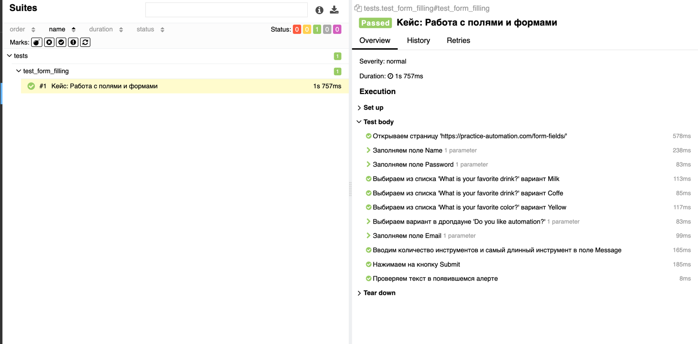

# Практикум SDET: тестовое задание

### Используемые технологии и инструменты
1) Python 3.10
2) Selenium Webdriver + Chrome
3) Cелекторы для поиска элементов: CSS, XPath, ID
4) Тестовый фреймворк - PyTest
5) Паттерн проектирования Page Object Model
6) Формирования отчетов о пройденных тестах через Allure


### Порядок действий для запуска автотестов локально (для MacOs)

1. #### Установить python 3.10
2. #### Активировать виртуальное окружение

3. #### Установить пакеты
```
pip3 install -r requirements.txt
```

* Запуск всех тестов без отчета
```
pytest test_form_filling
```

* Запуск теста **test_form_filling** с генерацией отчета в allure
```
pytest -k test_form_filling --alluredir=allure_results

# запуск allure отчета локально
allure serve allure_results
```
Пример отчета о прохождении теста


